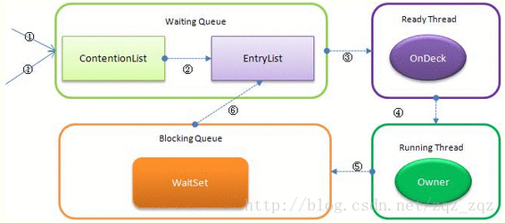

## 简介
在Java中，synchronized关键字是用来控制线程同步的，就是在多线程的环境下，控制synchronized代码段不被多个线程同时执行。synchronized既可以加在一段代码上，也可以加在方法上。

## Syschronized原理

它有多个队列，当多个线程一起访问某个对象监视器的时候，对象监视器会将这些线程存储在不同的容器中。

- Contention List：竞争队列，所有请求锁的线程首先被放在这个竞争队列中；
- Entry List：Contention List中那些有资格成为候选资源的线程被移动到Entry List中；
- Wait Set：哪些调用wait方法被阻塞的线程被放置在这里；
- OnDeck：任意时刻，最多只有一个线程正在竞争锁资源，该线程被成为OnDeck；
- Owner：当前已经获取到所资源的线程被称为Owner；
- !Owner：当前释放锁的线程。

### 使用场景

>如果锁的是类对象的话，尽管new多个实例对象，但他们仍然是属于同一个类依然会被锁住，即线程之间保证同步关系。